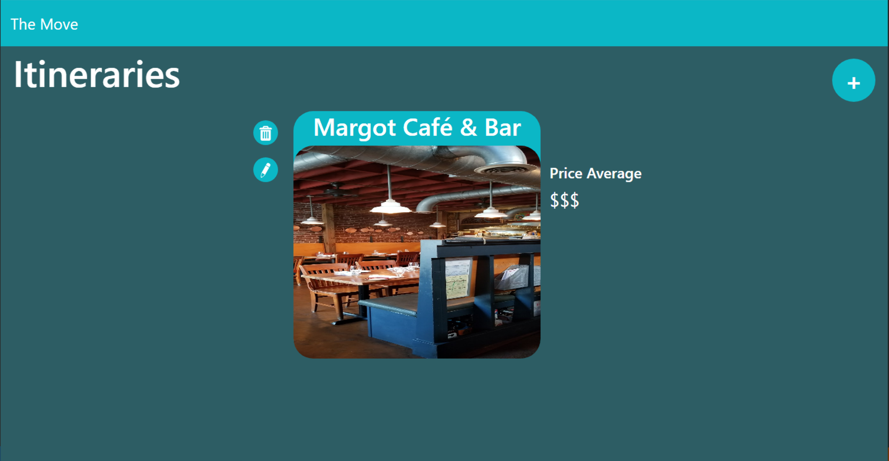
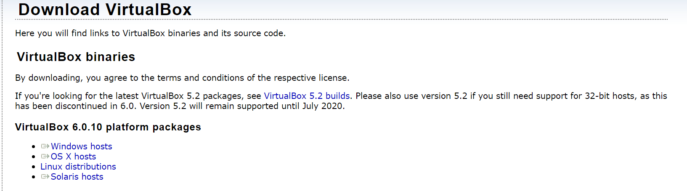
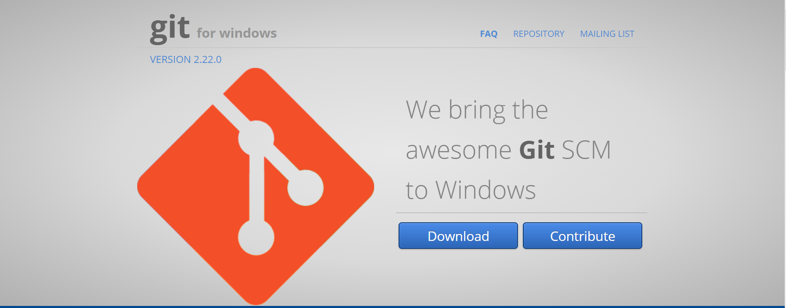
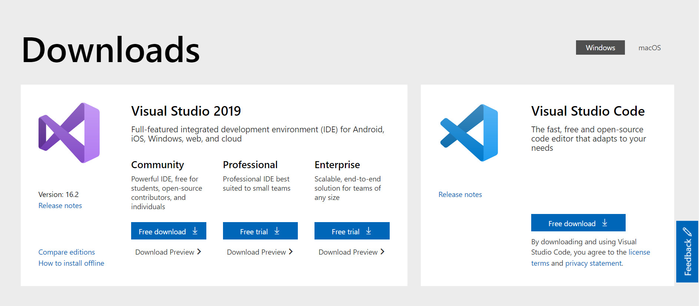
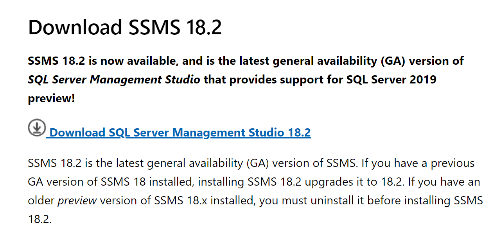

# The Move

The move is a CRUD application that allows users to create their own personal itinerary for locations in the Nashville area. The locations are curated using the Google Places API. The app's frontend was built in ReactJS and the backend was built in C#/.NET Core with SSMS as a database.



## Necesary Installs

- Oracle VirtualBox (only for mac users)
- Vagrant
- Git Bash
- Visual Studio 2019
- Google Chrome
- SQL Server Management Studio (SSMS)

### Oracle VitualBox
If you are working on a Mac, you'll need a virtual machine in order to work in SSMS.

To download VirtualBox click <a href="https://www.virtualbox.org/wiki/Downloads" >here</a>.

Select OS X hosts and then follow the setup process.



### Vagrant

To download click <a href="https://www.vagrantup.com">here</a>.

### Git Bash
After the Windows virtual machine has successfully been installed, you'll need to download Git Bash.

To download Git Bash click <a href="https://gitforwindows.org" >here</a>.

Follow the setup process.



### Visual Studio 2019 (or higher)

To download Visual Studio 2019 click <a href="https://visualstudio.microsoft.com/downloads/">here</a>. 

Run the installer for Visual Studio that gets downloaded, and on the first window that appears, make sure the following items are checked.

1. ASP.NET Web Development Tools
2. .NET Core Cross Platform Development

Then click install at the bottom.



### SQL Server Management Studio (SSMS)

To download SSMS click <a href="https://docs.microsoft.com/en-us/sql/ssms/download-sql-server-management-studio-ssms?view=sql-server-2017">here</a>. 

Then follow the setup process.



Once SSMS has completely downloaded you'll want to run the following query, which will create the database. 

```
USE [master]
GO
/****** Object:  Database [TheMove]    Script Date: 8/8/2019 10:57:20 PM ******/
CREATE DATABASE [TheMove]
 CONTAINMENT = NONE
 ON  PRIMARY 
( NAME = N'TheMove', FILENAME = N'C:\Program Files\Microsoft SQL Server\MSSQL14.MSSQLSERVER\MSSQL\DATA\TheMove.mdf' , SIZE = 8192KB , MAXSIZE = UNLIMITED, FILEGROWTH = 65536KB )
 LOG ON 
( NAME = N'TheMove_log', FILENAME = N'C:\Program Files\Microsoft SQL Server\MSSQL14.MSSQLSERVER\MSSQL\DATA\TheMove_log.ldf' , SIZE = 8192KB , MAXSIZE = 2048GB , FILEGROWTH = 65536KB )
GO
ALTER DATABASE [TheMove] SET COMPATIBILITY_LEVEL = 140
GO
IF (1 = FULLTEXTSERVICEPROPERTY('IsFullTextInstalled'))
begin
EXEC [TheMove].[dbo].[sp_fulltext_database] @action = 'enable'
end
GO
ALTER DATABASE [TheMove] SET ANSI_NULL_DEFAULT OFF 
GO
ALTER DATABASE [TheMove] SET ANSI_NULLS OFF 
GO
ALTER DATABASE [TheMove] SET ANSI_PADDING OFF 
GO
ALTER DATABASE [TheMove] SET ANSI_WARNINGS OFF 
GO
ALTER DATABASE [TheMove] SET ARITHABORT OFF 
GO
ALTER DATABASE [TheMove] SET AUTO_CLOSE OFF 
GO
ALTER DATABASE [TheMove] SET AUTO_SHRINK OFF 
GO
ALTER DATABASE [TheMove] SET AUTO_UPDATE_STATISTICS ON 
GO
ALTER DATABASE [TheMove] SET CURSOR_CLOSE_ON_COMMIT OFF 
GO
ALTER DATABASE [TheMove] SET CURSOR_DEFAULT  GLOBAL 
GO
ALTER DATABASE [TheMove] SET CONCAT_NULL_YIELDS_NULL OFF 
GO
ALTER DATABASE [TheMove] SET NUMERIC_ROUNDABORT OFF 
GO
ALTER DATABASE [TheMove] SET QUOTED_IDENTIFIER OFF 
GO
ALTER DATABASE [TheMove] SET RECURSIVE_TRIGGERS OFF 
GO
ALTER DATABASE [TheMove] SET  DISABLE_BROKER 
GO
ALTER DATABASE [TheMove] SET AUTO_UPDATE_STATISTICS_ASYNC OFF 
GO
ALTER DATABASE [TheMove] SET DATE_CORRELATION_OPTIMIZATION OFF 
GO
ALTER DATABASE [TheMove] SET TRUSTWORTHY OFF 
GO
ALTER DATABASE [TheMove] SET ALLOW_SNAPSHOT_ISOLATION OFF 
GO
ALTER DATABASE [TheMove] SET PARAMETERIZATION SIMPLE 
GO
ALTER DATABASE [TheMove] SET READ_COMMITTED_SNAPSHOT OFF 
GO
ALTER DATABASE [TheMove] SET HONOR_BROKER_PRIORITY OFF 
GO
ALTER DATABASE [TheMove] SET RECOVERY SIMPLE 
GO
ALTER DATABASE [TheMove] SET  MULTI_USER 
GO
ALTER DATABASE [TheMove] SET PAGE_VERIFY CHECKSUM  
GO
ALTER DATABASE [TheMove] SET DB_CHAINING OFF 
GO
ALTER DATABASE [TheMove] SET FILESTREAM( NON_TRANSACTED_ACCESS = OFF ) 
GO
ALTER DATABASE [TheMove] SET TARGET_RECOVERY_TIME = 60 SECONDS 
GO
ALTER DATABASE [TheMove] SET DELAYED_DURABILITY = DISABLED 
GO
ALTER DATABASE [TheMove] SET QUERY_STORE = OFF
GO
USE [TheMove]
GO
/****** Object:  Table [dbo].[InterestInterestTypes]    Script Date: 8/8/2019 10:57:21 PM ******/
SET ANSI_NULLS ON
GO
SET QUOTED_IDENTIFIER ON
GO
CREATE TABLE [dbo].[InterestInterestTypes](
	[Id] [int] IDENTITY(1,1) NOT NULL,
	[InterestId] [int] NOT NULL,
	[InterestTypeId] [int] NULL,
 CONSTRAINT [PK_InterestInterestTypes] PRIMARY KEY CLUSTERED 
(
	[Id] ASC
)WITH (PAD_INDEX = OFF, STATISTICS_NORECOMPUTE = OFF, IGNORE_DUP_KEY = OFF, ALLOW_ROW_LOCKS = ON, ALLOW_PAGE_LOCKS = ON) ON [PRIMARY]
) ON [PRIMARY]
GO
/****** Object:  Table [dbo].[Interests]    Script Date: 8/8/2019 10:57:21 PM ******/
SET ANSI_NULLS ON
GO
SET QUOTED_IDENTIFIER ON
GO
CREATE TABLE [dbo].[Interests](
	[Id] [int] IDENTITY(1,1) NOT NULL,
	[InterestName] [varchar](50) NOT NULL,
	[IsActive] [bit] NOT NULL,
 CONSTRAINT [PK_Interests] PRIMARY KEY CLUSTERED 
(
	[Id] ASC
)WITH (PAD_INDEX = OFF, STATISTICS_NORECOMPUTE = OFF, IGNORE_DUP_KEY = OFF, ALLOW_ROW_LOCKS = ON, ALLOW_PAGE_LOCKS = ON) ON [PRIMARY]
) ON [PRIMARY]
GO
/****** Object:  Table [dbo].[InterestTypes]    Script Date: 8/8/2019 10:57:21 PM ******/
SET ANSI_NULLS ON
GO
SET QUOTED_IDENTIFIER ON
GO
CREATE TABLE [dbo].[InterestTypes](
	[Id] [int] IDENTITY(1,1) NOT NULL,
	[InterestId] [int] NOT NULL,
	[InterestTypeName] [varchar](50) NOT NULL,
 CONSTRAINT [PK_InterestTypes] PRIMARY KEY CLUSTERED 
(
	[Id] ASC
)WITH (PAD_INDEX = OFF, STATISTICS_NORECOMPUTE = OFF, IGNORE_DUP_KEY = OFF, ALLOW_ROW_LOCKS = ON, ALLOW_PAGE_LOCKS = ON) ON [PRIMARY]
) ON [PRIMARY]
GO
/****** Object:  Table [dbo].[Itineraries]    Script Date: 8/8/2019 10:57:21 PM ******/
SET ANSI_NULLS ON
GO
SET QUOTED_IDENTIFIER ON
GO
CREATE TABLE [dbo].[Itineraries](
	[Id] [int] IDENTITY(1,1) NOT NULL,
	[UserId] [int] NOT NULL,
	[ItineraryName] [varchar](255) NULL,
 CONSTRAINT [PK_Itineraries] PRIMARY KEY CLUSTERED 
(
	[Id] ASC
)WITH (PAD_INDEX = OFF, STATISTICS_NORECOMPUTE = OFF, IGNORE_DUP_KEY = OFF, ALLOW_ROW_LOCKS = ON, ALLOW_PAGE_LOCKS = ON) ON [PRIMARY]
) ON [PRIMARY]
GO
/****** Object:  Table [dbo].[ItineraryLocations]    Script Date: 8/8/2019 10:57:21 PM ******/
SET ANSI_NULLS ON
GO
SET QUOTED_IDENTIFIER ON
GO
CREATE TABLE [dbo].[ItineraryLocations](
	[Id] [int] IDENTITY(1,1) NOT NULL,
	[LocationId] [int] NOT NULL,
	[ItineraryId] [int] NOT NULL,
 CONSTRAINT [PK_ItineraryLocations] PRIMARY KEY CLUSTERED 
(
	[Id] ASC
)WITH (PAD_INDEX = OFF, STATISTICS_NORECOMPUTE = OFF, IGNORE_DUP_KEY = OFF, ALLOW_ROW_LOCKS = ON, ALLOW_PAGE_LOCKS = ON) ON [PRIMARY]
) ON [PRIMARY]
GO
/****** Object:  Table [dbo].[LocationInterestTypes]    Script Date: 8/8/2019 10:57:21 PM ******/
SET ANSI_NULLS ON
GO
SET QUOTED_IDENTIFIER ON
GO
CREATE TABLE [dbo].[LocationInterestTypes](
	[Id] [int] IDENTITY(1,1) NOT NULL,
	[InterestTypeId] [int] NULL,
	[LocationId] [int] NOT NULL,
 CONSTRAINT [PK_LocationInterestTypes] PRIMARY KEY CLUSTERED 
(
	[Id] ASC
)WITH (PAD_INDEX = OFF, STATISTICS_NORECOMPUTE = OFF, IGNORE_DUP_KEY = OFF, ALLOW_ROW_LOCKS = ON, ALLOW_PAGE_LOCKS = ON) ON [PRIMARY]
) ON [PRIMARY]
GO
/****** Object:  Table [dbo].[Locations]    Script Date: 8/8/2019 10:57:21 PM ******/
SET ANSI_NULLS ON
GO
SET QUOTED_IDENTIFIER ON
GO
CREATE TABLE [dbo].[Locations](
	[Id] [int] IDENTITY(1,1) NOT NULL,
	[UserId] [int] NOT NULL,
	[ItineraryId] [int] NOT NULL,
	[LocationName] [varchar](255) NOT NULL,
	[Address] [varchar](255) NULL,
	[Rating] [decimal](3, 2) NULL,
	[Price] [int] NULL,
	[Photo_Ref] [varchar](255) NULL,
	[Html_Attr] [varchar](255) NULL,
	[Latitude] [decimal](9, 6) NULL,
	[Longitude] [decimal](9, 6) NULL,
 CONSTRAINT [PK_Locations] PRIMARY KEY CLUSTERED 
(
	[Id] ASC
)WITH (PAD_INDEX = OFF, STATISTICS_NORECOMPUTE = OFF, IGNORE_DUP_KEY = OFF, ALLOW_ROW_LOCKS = ON, ALLOW_PAGE_LOCKS = ON) ON [PRIMARY]
) ON [PRIMARY]
GO
/****** Object:  Table [dbo].[UserInterests]    Script Date: 8/8/2019 10:57:21 PM ******/
SET ANSI_NULLS ON
GO
SET QUOTED_IDENTIFIER ON
GO
CREATE TABLE [dbo].[UserInterests](
	[Id] [int] IDENTITY(1,1) NOT NULL,
	[UserId] [int] NOT NULL,
	[InterestId] [int] NOT NULL,
 CONSTRAINT [PK_UserInterests] PRIMARY KEY CLUSTERED 
(
	[Id] ASC
)WITH (PAD_INDEX = OFF, STATISTICS_NORECOMPUTE = OFF, IGNORE_DUP_KEY = OFF, ALLOW_ROW_LOCKS = ON, ALLOW_PAGE_LOCKS = ON) ON [PRIMARY]
) ON [PRIMARY]
GO
/****** Object:  Table [dbo].[UserItineraries]    Script Date: 8/8/2019 10:57:21 PM ******/
SET ANSI_NULLS ON
GO
SET QUOTED_IDENTIFIER ON
GO
CREATE TABLE [dbo].[UserItineraries](
	[Id] [int] IDENTITY(1,1) NOT NULL,
	[UserId] [int] NOT NULL,
	[ItineraryId] [int] NOT NULL,
 CONSTRAINT [PK_UserItineraries] PRIMARY KEY CLUSTERED 
(
	[Id] ASC
)WITH (PAD_INDEX = OFF, STATISTICS_NORECOMPUTE = OFF, IGNORE_DUP_KEY = OFF, ALLOW_ROW_LOCKS = ON, ALLOW_PAGE_LOCKS = ON) ON [PRIMARY]
) ON [PRIMARY]
GO
/****** Object:  Table [dbo].[Users]    Script Date: 8/8/2019 10:57:21 PM ******/
SET ANSI_NULLS ON
GO
SET QUOTED_IDENTIFIER ON
GO
CREATE TABLE [dbo].[Users](
	[Id] [int] IDENTITY(1,1) NOT NULL,
	[FirstName] [nchar](50) NOT NULL,
	[LastName] [nchar](50) NOT NULL,
	[Username] [nchar](50) NOT NULL,
	[Email] [nchar](50) NOT NULL,
	[Password] [nchar](255) NOT NULL,
	[Budget] [decimal](4, 0) NULL,
	[TravelRadius] [int] NULL,
 CONSTRAINT [PK_Users] PRIMARY KEY CLUSTERED 
(
	[Id] ASC
)WITH (PAD_INDEX = OFF, STATISTICS_NORECOMPUTE = OFF, IGNORE_DUP_KEY = OFF, ALLOW_ROW_LOCKS = ON, ALLOW_PAGE_LOCKS = ON) ON [PRIMARY]
) ON [PRIMARY]
GO
ALTER TABLE [dbo].[InterestInterestTypes]  WITH CHECK ADD  CONSTRAINT [FK_InterestInterestTypes_InterestInterestTypes] FOREIGN KEY([InterestId])
REFERENCES [dbo].[Interests] ([Id])
ON UPDATE CASCADE
GO
ALTER TABLE [dbo].[InterestInterestTypes] CHECK CONSTRAINT [FK_InterestInterestTypes_InterestInterestTypes]
GO
ALTER TABLE [dbo].[InterestTypes]  WITH CHECK ADD  CONSTRAINT [FK_InterestTypes_Interests] FOREIGN KEY([InterestId])
REFERENCES [dbo].[Interests] ([Id])
ON UPDATE CASCADE
ON DELETE CASCADE
GO
ALTER TABLE [dbo].[InterestTypes] CHECK CONSTRAINT [FK_InterestTypes_Interests]
GO
ALTER TABLE [dbo].[ItineraryLocations]  WITH CHECK ADD  CONSTRAINT [FK_ItineraryLocations_Itineraries] FOREIGN KEY([ItineraryId])
REFERENCES [dbo].[Itineraries] ([Id])
ON UPDATE CASCADE
ON DELETE CASCADE
GO
ALTER TABLE [dbo].[ItineraryLocations] CHECK CONSTRAINT [FK_ItineraryLocations_Itineraries]
GO
ALTER TABLE [dbo].[ItineraryLocations]  WITH CHECK ADD  CONSTRAINT [FK_ItineraryLocations_Locations] FOREIGN KEY([LocationId])
REFERENCES [dbo].[Locations] ([Id])
ON UPDATE CASCADE
ON DELETE CASCADE
GO
ALTER TABLE [dbo].[ItineraryLocations] CHECK CONSTRAINT [FK_ItineraryLocations_Locations]
GO
ALTER TABLE [dbo].[LocationInterestTypes]  WITH CHECK ADD  CONSTRAINT [FK_LocationInterestTypes_InterestTypes] FOREIGN KEY([InterestTypeId])
REFERENCES [dbo].[InterestTypes] ([Id])
ON UPDATE CASCADE
ON DELETE CASCADE
GO
ALTER TABLE [dbo].[LocationInterestTypes] CHECK CONSTRAINT [FK_LocationInterestTypes_InterestTypes]
GO
ALTER TABLE [dbo].[LocationInterestTypes]  WITH CHECK ADD  CONSTRAINT [FK_LocationInterestTypes_Locations] FOREIGN KEY([LocationId])
REFERENCES [dbo].[Locations] ([Id])
ON UPDATE CASCADE
ON DELETE CASCADE
GO
ALTER TABLE [dbo].[LocationInterestTypes] CHECK CONSTRAINT [FK_LocationInterestTypes_Locations]
GO
ALTER TABLE [dbo].[UserInterests]  WITH CHECK ADD  CONSTRAINT [FK_UserInterests_Interests] FOREIGN KEY([InterestId])
REFERENCES [dbo].[Interests] ([Id])
ON UPDATE CASCADE
GO
ALTER TABLE [dbo].[UserInterests] CHECK CONSTRAINT [FK_UserInterests_Interests]
GO
ALTER TABLE [dbo].[UserInterests]  WITH CHECK ADD  CONSTRAINT [FK_UserInterests_Users] FOREIGN KEY([UserId])
REFERENCES [dbo].[Users] ([Id])
ON UPDATE CASCADE
GO
ALTER TABLE [dbo].[UserInterests] CHECK CONSTRAINT [FK_UserInterests_Users]
GO
ALTER TABLE [dbo].[UserItineraries]  WITH CHECK ADD  CONSTRAINT [FK_UserItineraries_Itineraries] FOREIGN KEY([ItineraryId])
REFERENCES [dbo].[Itineraries] ([Id])
ON UPDATE CASCADE
ON DELETE CASCADE
GO
ALTER TABLE [dbo].[UserItineraries] CHECK CONSTRAINT [FK_UserItineraries_Itineraries]
GO
ALTER TABLE [dbo].[UserItineraries]  WITH CHECK ADD  CONSTRAINT [FK_UserItineraries_Users] FOREIGN KEY([UserId])
REFERENCES [dbo].[Users] ([Id])
ON UPDATE CASCADE
ON DELETE CASCADE
GO
ALTER TABLE [dbo].[UserItineraries] CHECK CONSTRAINT [FK_UserItineraries_Users]
GO
USE [master]
GO
ALTER DATABASE [TheMove] SET  READ_WRITE 
GO

```
# Running the application
All that's left to do is to clone down the project from the repository and then start it by executing the code in visual studio.